# DevRestaurante

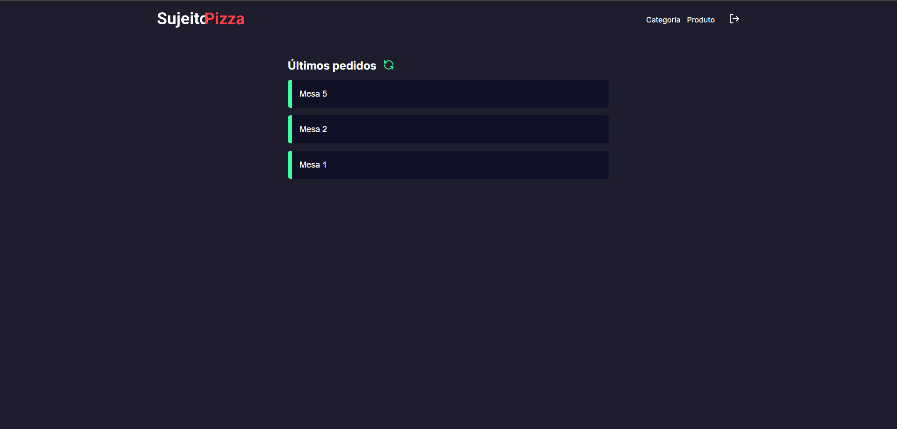

O **DevRestaurante** é uma aplicação de nível profissional para criação, gerenciamento e acompanhamento do cardápio e pedidos de um estabelecimento alimentício, como restaurantes, pizzarias ou outros. Desenvolvido no monorepo acima com _Next, Sass e TypeScript_ para a página web de acompanhamento de pedidos e gerenciamento do cardápio, _Expo, React-navigation e TypeScript_ para o aplicativo com criação de pedidos, a aplicação utiliza API padrão RESTFUL, utilizando de _Express, Prisma, Clodinary e Neon-postgres_ para gerenciamento dos dados e  _Bcrypt_ para criação e gerenciamento do token de autenticação.
## Sumário

1. [Visão Geral do Projeto](#visão-geral-do-projeto-funcionalidades-principais)
   - [Acompanhamento e gerenciamento em tempo real dos pedidos](#1-acompanhamento-e-gerenciamento-em-tempo-real-dos-pedidos)
   - [Gerenciamento do cardápio](#2-gerenciamento-do-cardápio)
   - [Registro de novos pedidos](#3-registro-de-novos-pedidos)
2. [Tecnologias Utilizadas](#tecnologias-utilizadas-linguagens-e-ferramentas)
3. [Estrutura do Projeto](#estrutura-do-projeto)
5. [Screenshots](#screenshots)
   - [Mobile](#mobile)
   - [Web](#web)
6. [Requisitos para Rodar o Projeto Localmente](#requisitos-para-rodar-o-projeto-localmente)
7. [Rodar o Projeto Localmente](#rodar-o-projeto-localmente)
8. [Autores](#autores)
9. [Licença](#licença)

## Visão Geral do Projeto (Funcionalidades Principais)

### 1. Acompanhamento e gerenciamento em tempo real dos pedidos:

- Na página web da aplicação você possui as seguintes opções quanto a isso:
  1. Acompanhamento de todos os pedidos enviados para preparo.
  2. Detalhamento desse pedido, como:
    1. Produtos do pedido
       - Imagem do produto
       - Nome
       - Quantidade de produtos
       - Valor
    2. Valor total do pedido da mesa
  3. Finalização de pedidos em aberto.

### 2. Gerenciamento do cardápio:

- Na página web da aplicação você possui, também, as seguintes ações para gerenciar o cardápio:
  1. Criação de novas categorias em seu cardápio.
  2. Adição de novos produtos podendo editar:
     - Categoria que faz parte
     - Nome do produto
     - Valor
     - Descrição

### 3. Registro de novos pedidos:

- No aplicativo da aplicação você possui as seguintes opções para criação e envio de pedidos para o preparo:
  1. Abertura da comanda da mesa.
  2. Adição de produtos no pedido da mesa, podendo optar por:
     - Categoria que deseja filtrar os produtos
     - O produto que será adicionado
     - Quantidade daquele produto
  3. Enviar o pedido para preparo.

## Tecnologias Utilizadas (Linguagens e ferramentas)

<table>
    <tr>
      <td align="center">
        <a href="https://nextjs.org/">
          
          <br />
          <sub>
            <b>Next.JS</b>
          </sub>
        </a>
      </td>
      <td align="center">
        <a href="https://nodejs.org/pt">
          
          <br />
          <sub>
            <b>NodeJS - Express</b>
          </sub>
        </a>
      </td>
      <td align="center">
        <a href="https://expo.dev/go">
          
          <br />
          <sub>
            <b>Expo GO</b>
          </sub>
        </a>
      </td>
      <td align="center">
        <a href="https://sass-lang.com/">
          
          <br />
          <sub>
            <b>Sass</b>
          </sub>
        </a>
      </td>
      <td align="center">
        <a href="https://www.typescriptlang.org/">
          
          <br />
          <sub>
            <b>TypeScript</b>
          </sub>
        </a>
      </td>
    </tr>
</table>
<table border-style="none">
  <tr>
    <td align="center">
      <a href="https://www.postgresql.org/">
        <br />
        <sub>
          <b>Postgres</b>
        </sub>
      </a>
    </td>
    <td align="center">
      <a href="https://www.prisma.io/?via=start&gad_source=1&gclid=CjwKCAiAh6y9BhBREiwApBLHC9l2TMrWhYJPi787DeRP5SCnQp6MnosFLDKIvTfWJ9IoUl684SdROhoCrTUQAvD_BwE">
        <br />
        <sub>
          <b>Prisma</b>
        </sub>
      </a>
    </td>
    <td align="center">
      <a href="https://cloudinary.com/">
        <br />
        <sub>
          <b>Cloudinary</b>
        </sub>
      </a>
    </td>
    <td align="center">
      <a href="https://neon.tech/">
        <br />
        <sub>
          <b>Neon-Postgres</b>
        </sub>
      </a>
    </td>
    <td align="center">
      <a href="https://git-scm.com/">
        <br />
        <sub>
          <b>Git</b>
        </sub>
      </a>
    </td>
  </tr>
</table>

## Estrutura do Projeto

O projeto é organizado em vários arquivos para melhor organização do código e separação de interesses:

- `/backend`: É a pasta responsável pelo backend da aplicação, onde relaciona-se as rotas com os serviços de banco de dados e armazenamento de imagens;
- `/frontend`: É a pasta responsável pelo frontend da aplicação, onde estruturamos as páginas e consumimos dados e funcionalidades com a API;
- `/mobile`: É a pasta responsável pelo aplicativo da aplicação, onde estruturamos as páginas e consumimos dados e funcionalidades com a API;
- `/readme_images`: É a pasta responsável pelas imagens abaixo para demonstração do design e funcionalidades da aplicação;

## Screenshots

### Mobile

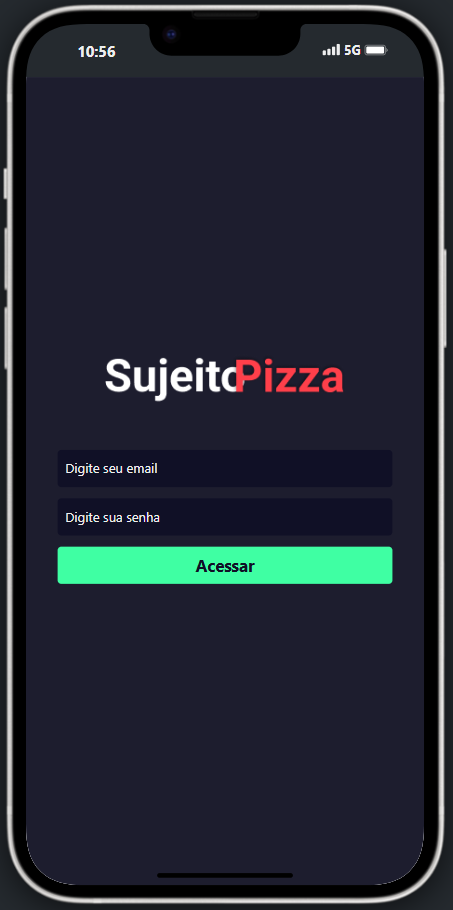
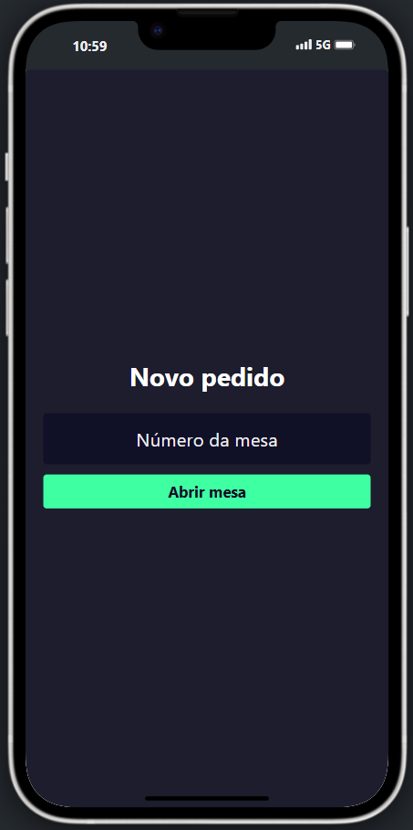
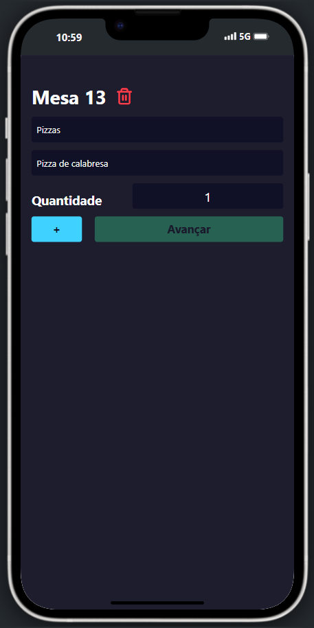
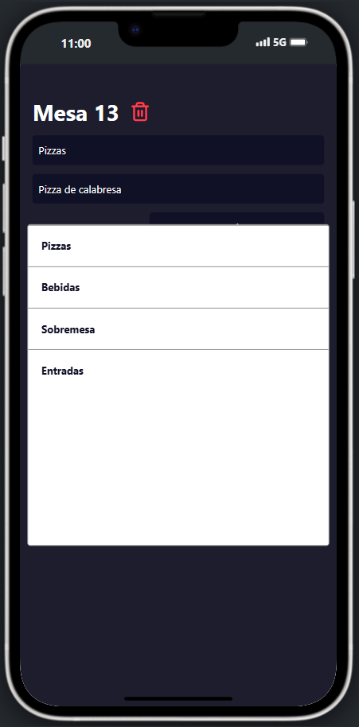
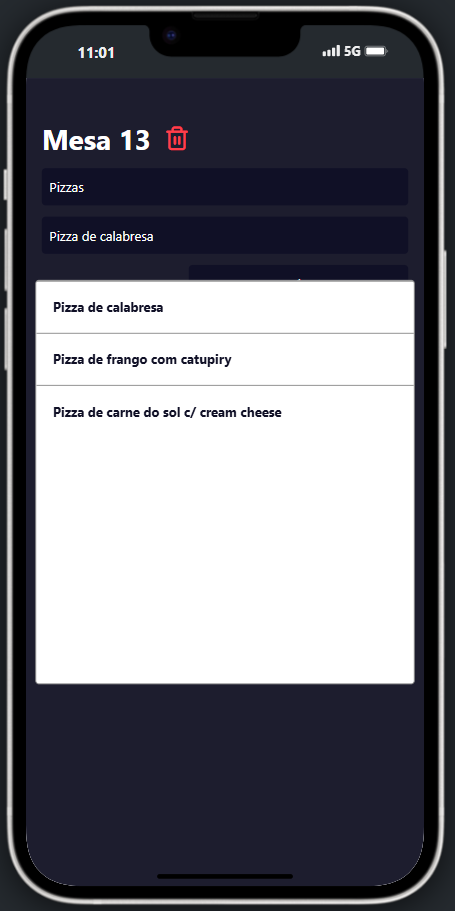
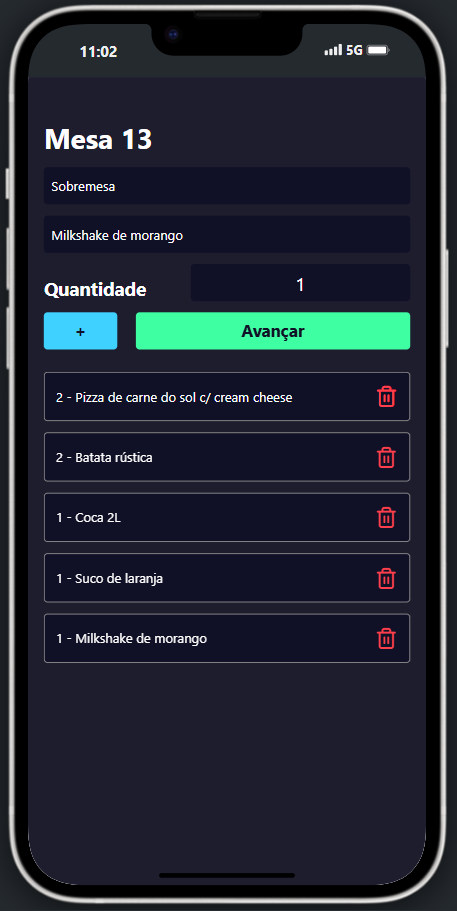
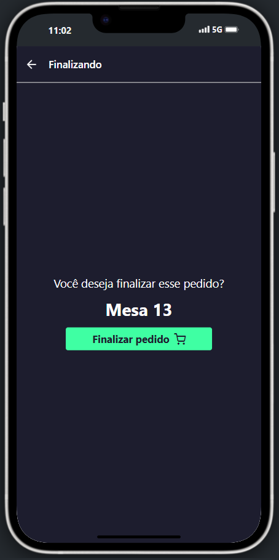

### Web

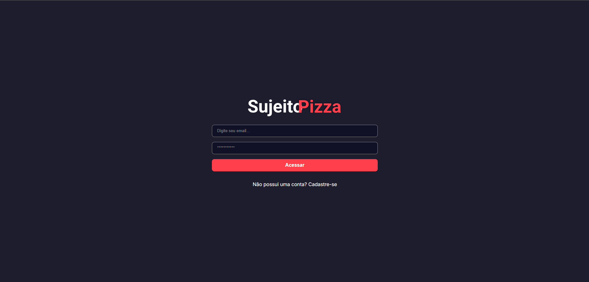
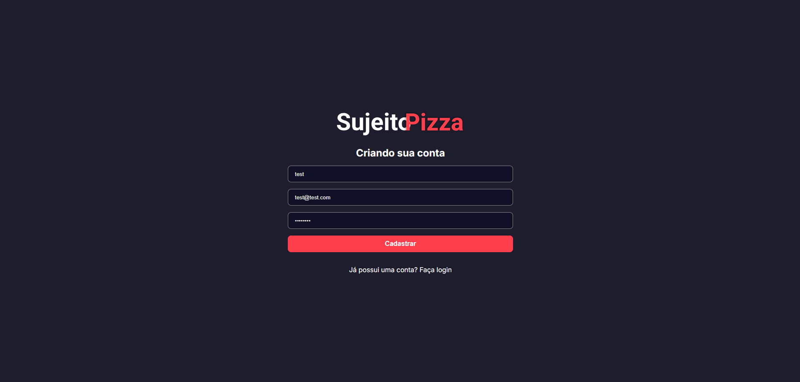

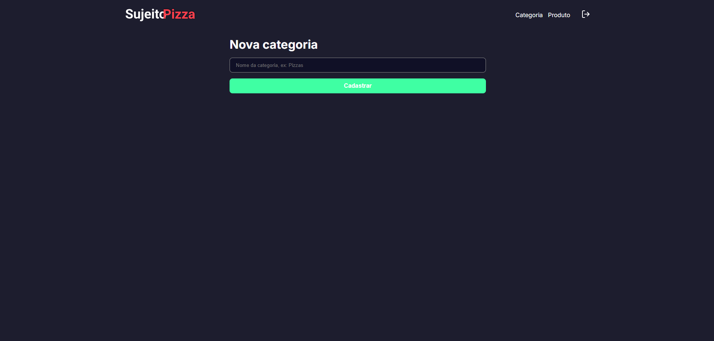
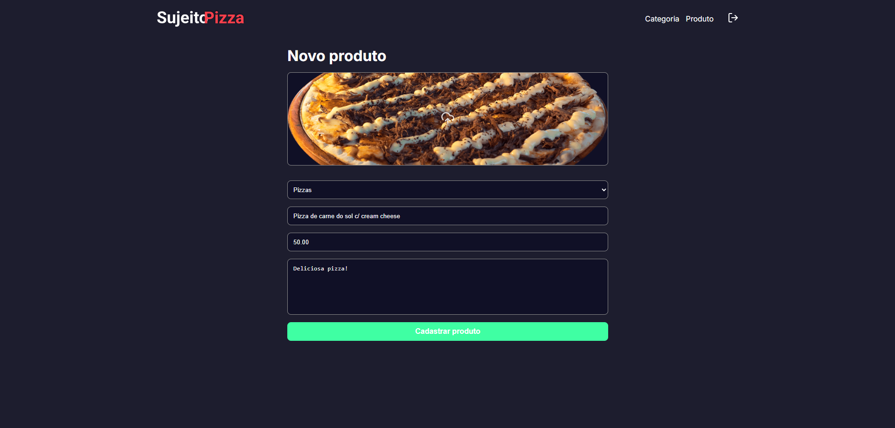
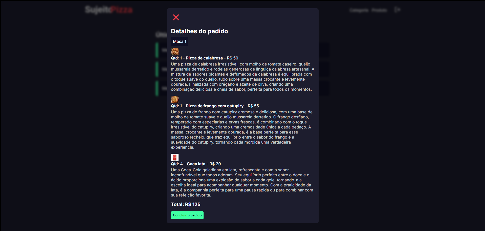

## Requisitos para Rodar o Projeto Localmente

### Node.js e npm:

- Verifique se você tem o Node.js instalado. Caso contrário, faça o download e instale a versão mais recente do Node.js.
- O npm (Node Package Manager) é instalado automaticamente com o Node.js.

### Git:

- Certifique-se de ter o Git instalado em sua máquina. Se não tiver, você pode baixá-lo aqui.

### Editor de Texto ou IDE:

- Escolha um editor de texto ou uma IDE (Ambiente de Desenvolvimento Integrado) para trabalhar no código. Alguns exemplos populares incluem o Visual Studio Code, Sublime Text e Atom.

### Navegador Web:

- Você precisará de um navegador web para visualizar o aplicativo localmente. Recomendamos o uso do Google Chrome, Mozilla Firefox ou Microsoft Edge.

### Configuração dos sistemas externos:

- Necessita realizar toda a configuração do Prisma, Postgres e Cloudinary.

## Rodar o Projeto Localmente

**Clone o projeto**

```bash
  git clone https://github.com/MarcioJorgeMelo/dev-restaurante.git
```

**Vá para a pasta do projeto**

```bash
  cd dev-restaurante
```

**Abra o projeto no VSCode**

```bash
  code .
```

**Instale as dependências de cada aplicação**

```bash
  cd backend
```

```bash
  npm install # Instala as dependências (se ainda não tiver feito)
```

```bash
  npx prisma generate
```

```bash
  cd frontend
```

```bash
  npm install # Instala as dependências (se ainda não tiver feito)
```

```bash
  cd mobile
```

```bash
  npm install # Instala as dependências (se ainda não tiver feito)
```

**Rode os projetos**

```bash
  cd backend
```

```bash
  npm run dev
```

```bash
  cd frontend
```

```bash
  npm run dev
```

```bash
  cd mobile
```

```bash
  yarn start
```

## Autores

- [@MarcioJorgeMelo](https://github.com/MarcioJorgeMelo)

## Licença

- [MIT](https://choosealicense.com/licenses/mit/)
